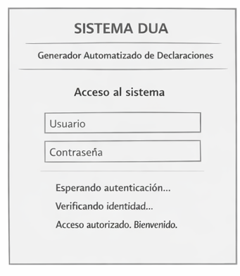
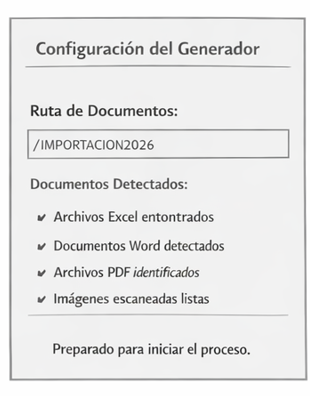
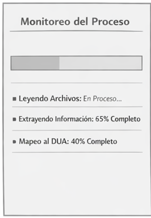
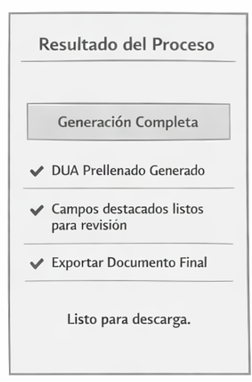
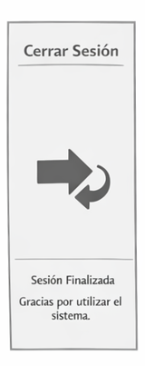

# DUA Streamliner

## Intelligent System for the Automated Generation of the Single Customs Declaration (DUA)

---

## Problem to be Solved

The Single Customs Declaration (DUA) is the official document used to declare goods before the customs authority in Costa Rica.

Proper preparation of the DUA requires interpreting multiple source documents such as:

- Commercial invoices  
- Packing lists  
- Certificates of origin  
- Bills of lading  
- Insurance policies and special permits  

These documents are often provided in heterogeneous formats such as Excel, Word, PDF, and scanned images.

Manual completion of the DUA is a repetitive process, prone to errors, and highly dependent on expert knowledge.

The **DUA Streamliner** project proposes the design of an automated system capable of:

- Reading documents in multiple formats  
- Extracting semantic information using artificial intelligence  
- Automatically mapping data to the official DUA template  
- Generating a pre-filled Word document with confidence indicators  

The objective is to transform the customs expert into a strategic validator, reducing manual operational workload and minimizing errors.

---

##  Authors

**Name:** Catherin Madriz Badilla  
**Course:** Software Design  
**Professor:** Rodrigo Núñez  
**University:** Instituto Tecnológico de Costa Rica  

#Frontend Desing
1.1 Technology stack: tecnología de frontend, de seguridad, librerías de terceros, frameworks, hosting; todos con su respectiva versión
Application type: web
TypeScript 5.9.3
Framework:React 18.2.0
Unit testing:Jest 29 ,React Testing Library 14
Data validation framework:zod
Code prettier framework:prettier
Code style framework:ESLint

Integration testing:Playwright 1.58
Hosting by:AWS
Cloud Service: AWS 
Code Repository:GitHub
Code automation task tool:Git hooks with Husky
CI CD pipelines technology:GitHub Actions
Environments:Development,Staging,Production
Environment deployments tools:GitHub Actions,AWS CLI
Observability framework:AWS CloudWatch

1.2 UX UI analysis: Incluye los atributos de usabilidad deseables del aplicativo, un diseño preliminar del UX a modo wireframes, y las evidencias de las pruebas de UX con usuarios reales que validan diseño diseño preliminar

##Login

The person accesses the system in order to start the DUA generation process.
The system requests the information necessary to identify the user.
The user provides the required access information.
The system receives the information and proceeds to validate the user's identity.
The system compares the provided information with the records stored in the database.
If the information matches, the system confirms that the identity is valid.
The system initiates a secure session for the user.
The system records the access event in the system log for monitoring and auditing purposes.
The system allows the user to continue to the stage where the DUA generation process can be prepared.

###Configure Generator

The user starts a new DUA generation process.
The system requests the location where the documents required for the declaration are stored.
The user provides the folder path containing the documents.
The system accesses the specified folder.
The system analyzes the folder and detects all available files.
The system automatically identifies the different types of documents found.
The system prepares the detected documents for processing.
The user confirms that the document analysis process should begin.
The system registers the start of the DUA generation process.
The system initializes the processing engines responsible for reading and interpreting the information contained in the documents.

###Monitor Progress

After the process begins, the system starts analyzing the provided documents.
The user checks the current status of the process to observe its progress.
The system presents information about the tasks that are currently being executed.
The system begins reading the files located in the provided folder.
The system extracts textual content from the documents.
If scanned images or image-based documents are detected, the system performs optical character recognition to convert images into text.
After obtaining the text, the system analyzes the content to identify the relevant information required for the customs declaration.
The system interprets the detected information using artificial intelligence models trained to recognize customs-related terminology.
The system organizes the extracted data and prepares it to be mapped into the corresponding fields of the DUA template.
Throughout the process, the system continuously updates the progress status until the analysis is completed.

###Result Retrieval / Export

Once the document processing is completed, the system confirms that the DUA generation process has finished.
The system organizes all extracted information and assigns it to the corresponding fields of the official DUA template.
The system performs basic validation checks to verify the consistency of the extracted data.
The system detects possible inconsistencies or information with low confidence levels.
The system generates a document containing the fully pre-filled DUA using the analyzed data.
The user accesses the generated document in order to review the information included.
The system makes the final document available for retrieval and further use.
The resulting document can then be stored, reviewed, or used in the customs declaration process.

###Log Out

After finishing the work session, the user decides to end the interaction with the system.
The system receives the request to terminate the active session.
The system stores the final state of the work performed during the session.
The system records the logout event in the system log.
The system closes the active session and removes the temporary access permissions associated with the user.
The system returns to the initial authentication state, waiting for a new user session.

1.3 Component design strategy: Define la técnica y los principios de diseño de componentes del frontend, cómo se logra la reutilización de componentes, cómo se logra centralizar los estilos, el branding, la internacionalización y la responsividad.
1.4 Security: Tecnologías, técnicas y classes con su respectiva ubicación en la estructura del proyecto responsables de la autenticación y la autorización de permisos y sesiones. 
1.5 Layered design: diseño y explicación de las diversas capas de la aplicación en el frontend. 
1.6  Design patterns: Diseño de classes con su respectiva ubicación en la estructura del proyecto, donde sea necesario aplicar patrones de diseño orientado a objetos, como por ejemplo: seguridad, refrescado de UI, recepción de notificaciones, almacenamiento de estados, llamadas a api, operaciones asíncronas, invalidación de sesiones, programación por eventos, creación de objetos. 
1.7 un folder en /src que contiene el scaffold del proyecto, el cual se genera a partir de toda la especificación de los puntos del 1.1 al 1.6. 
