# DUA Streamliner

## Intelligent System for the Automated Generation of the Single Customs Declaration (DUA)

---

## Problem to be Solved

The Single Customs Declaration (DUA) is the official document used to declare goods before the customs authority in Costa Rica.

Proper preparation of the DUA requires interpreting multiple source documents such as:

- Commercial invoices  
- Packing lists  
- Certificates of origin  
- Bills of lading  
- Insurance policies and special permits  

These documents are often provided in heterogeneous formats such as Excel, Word, PDF, and scanned images.

Manual completion of the DUA is a repetitive process, prone to errors, and highly dependent on expert knowledge.

The **DUA Streamliner** project proposes the design of an automated system capable of:

- Reading documents in multiple formats  
- Extracting semantic information using artificial intelligence  
- Automatically mapping data to the official DUA template  
- Generating a pre-filled Word document with confidence indicators  

The objective is to transform the customs expert into a strategic validator, reducing manual operational workload and minimizing errors.

---

## Authors

**Name:** Catherin Madriz Badilla  
**Course:** Software Design  
**Professor:** Rodrigo Núñez  
**University:** Instituto Tecnológico de Costa Rica  

---

# Frontend Desing

## 1.1 Technology stack

Application type: web  

TypeScript 5.9.3  
Framework: React 18.2.0  
Unit testing: Jest 29, React Testing Library 14  
Data validation framework: zod  
Code prettier framework: prettier  
Code style framework: ESLint  

Integration testing: Playwright 1.58  

Hosting by: AWS  
Cloud Service: AWS  

Code Repository: GitHub  

Code automation task tool: Git hooks with Husky  

CI CD pipelines technology: GitHub Actions  

Environments: Development, Staging, Production  

Environment deployments tools: GitHub Actions, AWS CLI  

Observability framework: AWS CloudWatch

---

## 1.2 UX UI analysis
## Core business process

---

## Login

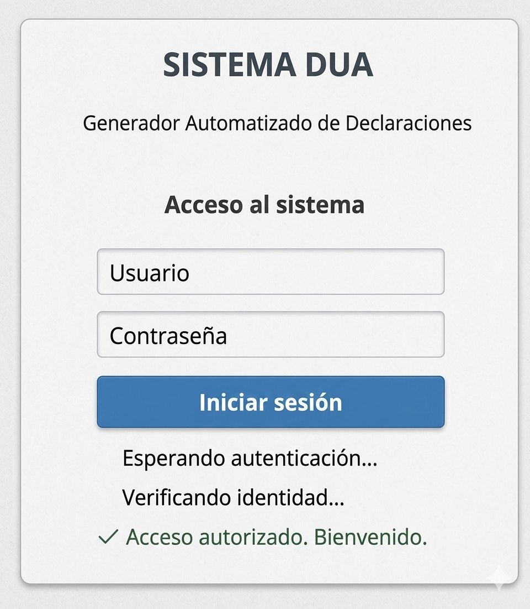

The person accesses the system in order to start the DUA generation process.  
The system requests the information necessary to identify the user.  
The user provides the required access information.  
The system receives the information and proceeds to validate the user's identity.  
The system compares the provided information with the records stored in the database.  
If the information matches, the system confirms that the identity is valid.  
The system initiates a secure session for the user.  
The system records the access event in the system log for monitoring and auditing purposes.  
The system allows the user to continue to the stage where the DUA generation process can be prepared.

---

## Configure Generator
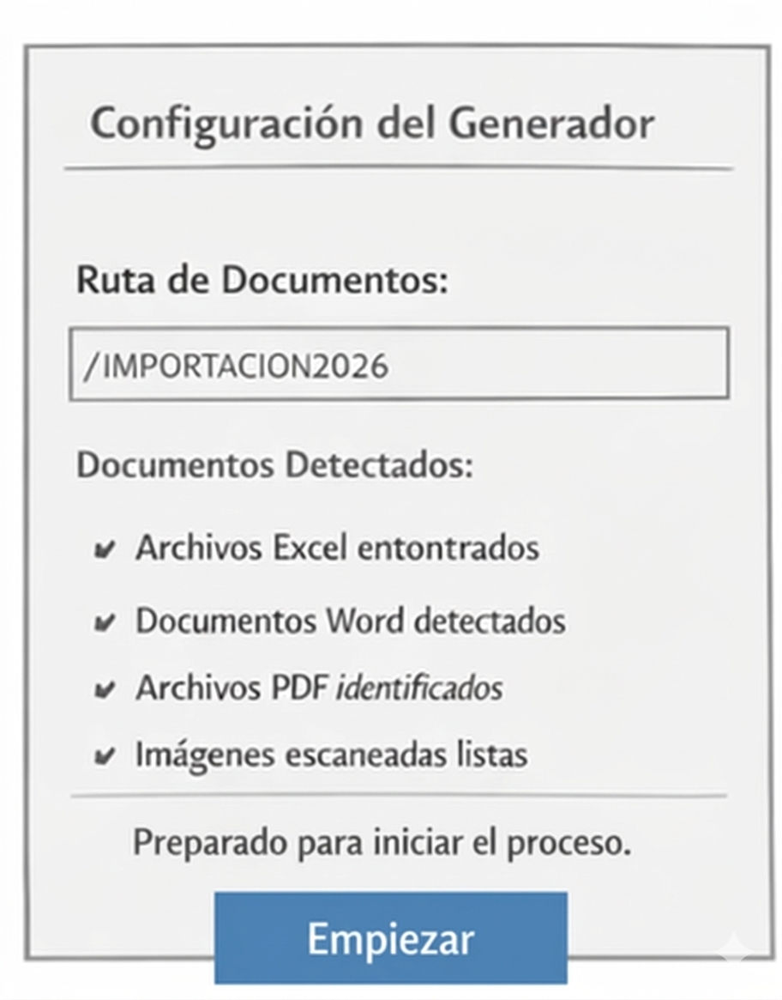

The user starts a new DUA generation process.  
The system requests the location where the documents required for the declaration are stored.  
The user provides the folder path containing the documents.  
The system accesses the specified folder.  
The system analyzes the folder and detects all available files.  
The system automatically identifies the different types of documents found.  
The system prepares the detected documents for processing.  
The user confirms that the document analysis process should begin.  
The system registers the start of the DUA generation process.  
The system initializes the processing engines responsible for reading and interpreting the information contained in the documents.

---

## Monitor Progress

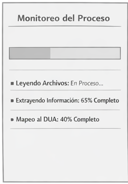

After the process begins, the system starts analyzing the provided documents.  
The user checks the current status of the process to observe its progress.  
The system presents information about the tasks that are currently being executed.  
The system begins reading the files located in the provided folder.  
The system extracts textual content from the documents.  
If scanned images or image-based documents are detected, the system performs optical character recognition to convert images into text.  
After obtaining the text, the system analyzes the content to identify the relevant information required for the customs declaration.  
The system interprets the detected information using artificial intelligence models trained to recognize customs-related terminology.  
The system organizes the extracted data and prepares it to be mapped into the corresponding fields of the DUA template.  
Throughout the process, the system continuously updates the progress status until the analysis is completed.

---

## Result Retrieval / Export

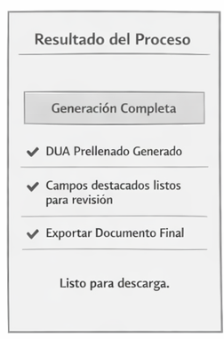

Once the document processing is completed, the system confirms that the DUA generation process has finished.  
The system organizes all extracted information and assigns it to the corresponding fields of the official DUA template.  
The system performs basic validation checks to verify the consistency of the extracted data.  
The system detects possible inconsistencies or information with low confidence levels.  
The system generates a document containing the fully pre-filled DUA using the analyzed data.  
The user accesses the generated document in order to review the information included.  
The system makes the final document available for retrieval and further use.  
The resulting document can then be stored, reviewed, or used in the customs declaration process.

---

## Log Out

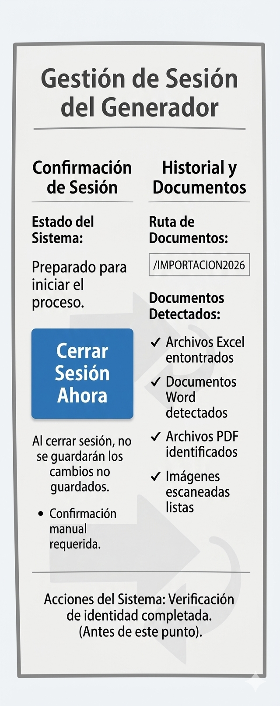

After finishing the work session, the user decides to end the interaction with the system.  
The system receives the request to terminate the active session.  
The system stores the final state of the work performed during the session.  
The system records the logout event in the system log.  
The system closes the active session and removes the temporary access permissions associated with the user.  
The system returns to the initial authentication state, waiting for a new user session.

---

## UX test results
## Results
| Participant | Location |Test Duration | Click Accuracy |
| :--- | :--- | :--- | :--- |
| **Natalia Picado** | Costa Rica | 59 s | 80% |
| **Catherin Madriz** | Costa Rica | 34 s | 90% |
| **Tamara Robles** | Costa Rica | 1 m 32 s | 60% |
| **Brandy Piedra** | Colombia | 2 m 21 s | 70% |

## Evidence
#### Heatmap
### Login Analysis
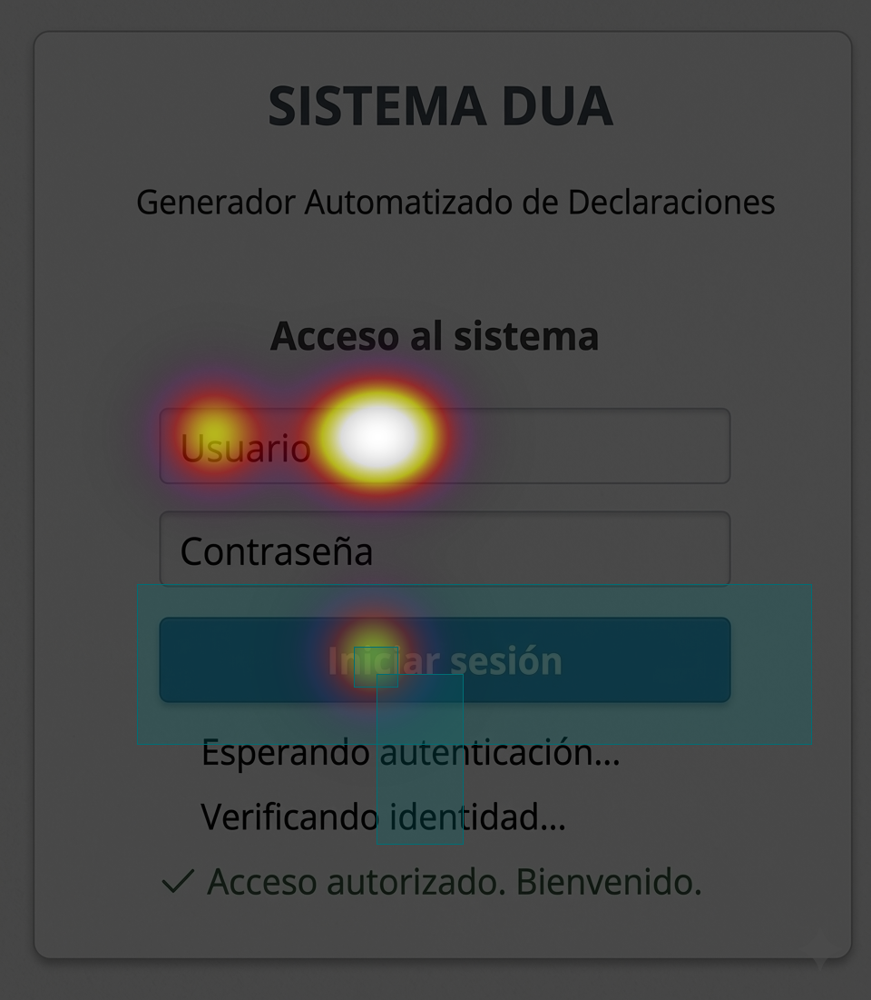

### Configuration Setup
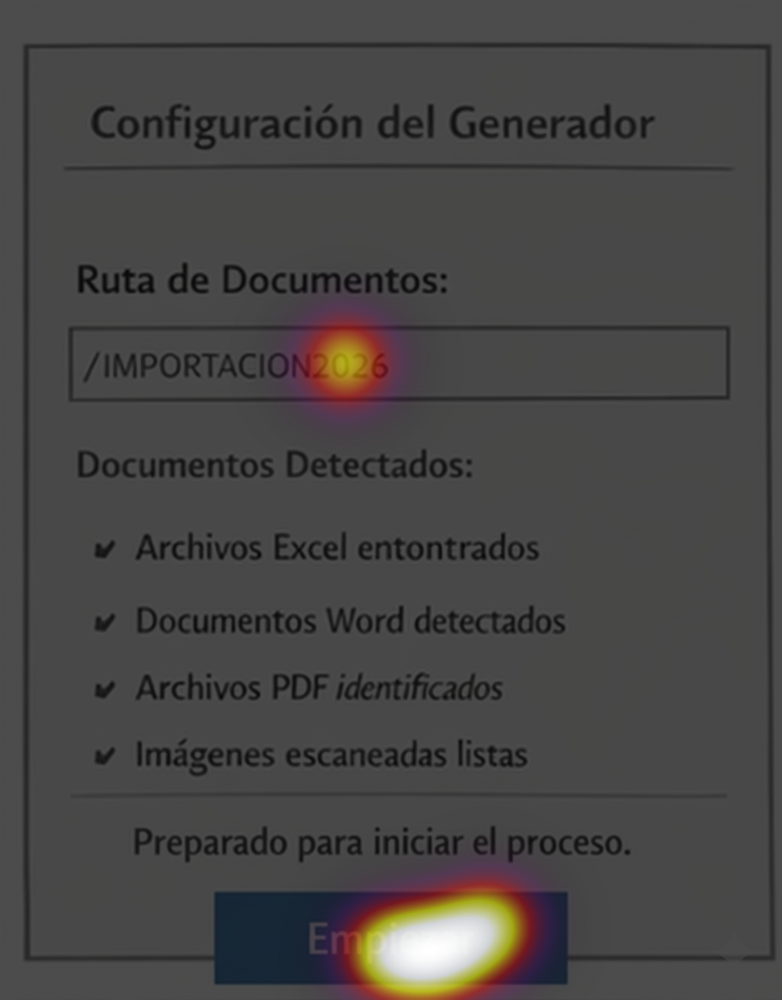

### Process Monitoring
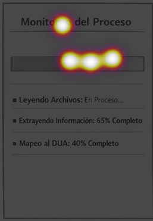

### Result Retrieval
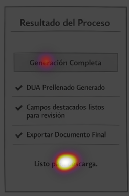
### Logout Process
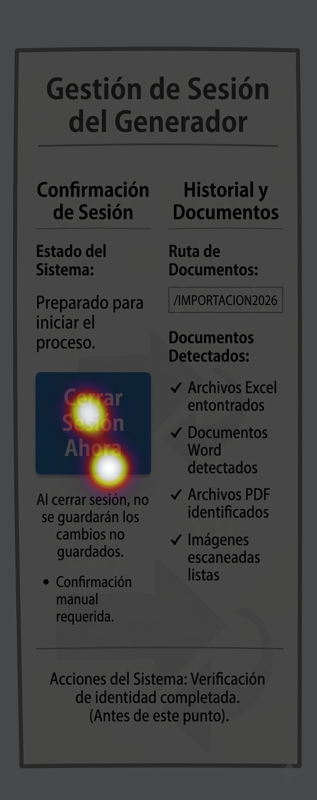

### Evidence: Individual Click Maps

| Natalia Picado | Catherin Madriz |
| :---: | :---: |
| 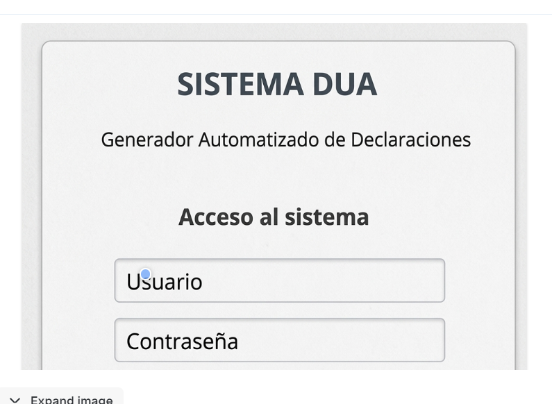 | 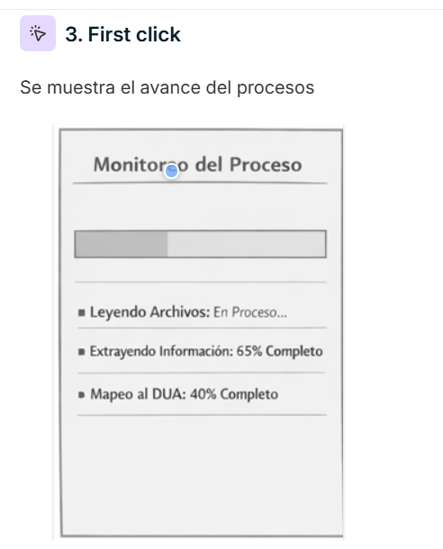 |
| **Tamara Robles** | **Brandy Piedra** |
| 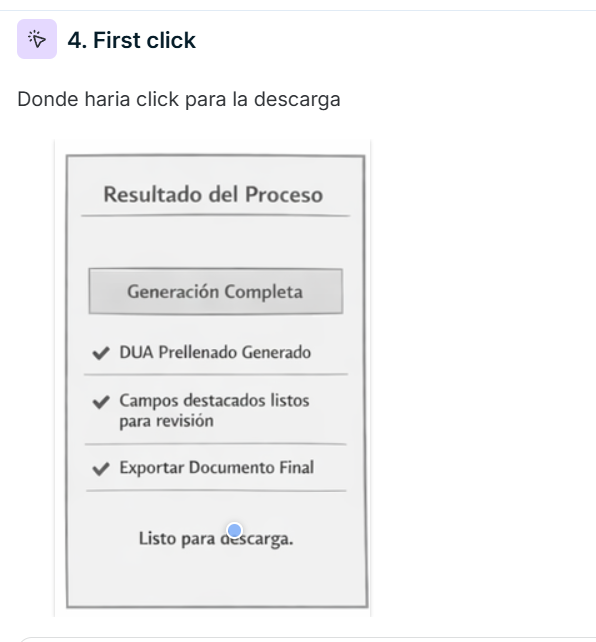 | 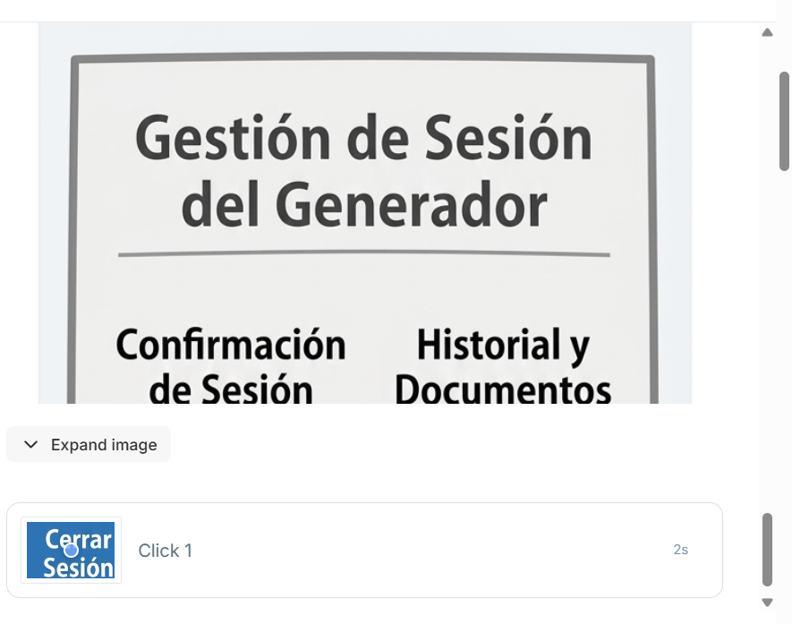 |

---

## 1.3 Component design strategy
name of the strategy: Atomic Design with Component Driven Development

reutilization by:
Reusable UI components organized in hierarchical levels:
Atoms: basic elements (buttons, inputs, labels)
Molecules: combination of atoms (form fields)
Organisms: complex UI blocks (navigation bar, forms)
Templates and pages

internacionalization by: react-i18next

responsiveness by: CSS Flexbox and Grid, Responsive layout patterns ,Media queries

---

## 1.4 Security

### MFA
The system will support MFA.
The selected methods will be:
**Authentication application (TOTP)**
Supported applications:
- Google Authenticator  
- Microsoft Authenticator  
**Email OTP**

### SSO Support
The system does not implement Single Sign-On

### Authentication Service
The system authentication is managed using Amazon Cognito, the identity management service provided by AWS.

### Social Authentication Support
The system does not support social authentication such as Google or Facebook login.

### Authorization Model
The system implements Role-Based Access Control (RBAC) to manage user permissions and system access.

**Roles:**

**Customs Officer:**  
Responsible for reviewing, validating, and approving generated DUA documents and customs data.

**Administrator:**  
Responsible for managing system configuration, users, and platform administration.

**Support Agent:**  
Responsible for assisting users, troubleshooting system issues, and reviewing processing errors.

### Secure Store Service
Sensitive configuration data such as API keys, tokens, environment variables, and credentials are stored using AWS Secrets Manager

### Authenticator Server Name

DUA Streamliner Authentication Server

---

## 1.5 Layered design

The frontend application follows a **Layered Architecture** combined with **Atomic Design principles** and is implemented using React 18 and TypeScript.

The application is deployed as a web application hosted on AWS.
### Authentication Flow
When a user accesses the system, the application checks for an active authenticated session.

If no session exists, the **Authentication Layer** is invoked using Amazon Cognito as the identity provider.
The system requires:
- Username and password authentication  
- Multi-Factor Authentication (MFA) using Authenticator Apps or Email OTP  

Single Sign-On (SSO) and social authentication (Google, Facebook) are not supported in order to maintain strict control over user identities.

If authentication is successful, a secure JWT token is issued and used for subsequent requests.

### Authorization Layer
The system implements **Role-Based Access Control (RBAC)**.
The defined roles are:

- Administrator  
- Customs Officer  
- Support Agent  

### Presentation Layer
The UI is rendered in the **Presentation Layer**, structured using **Atomic Design**:

- Atoms  
- Molecules  
- Organisms  
- Templates  
- Pages  
### Hooks Layer
Within the Presentation Layer, a **Hooks Layer** connects user interactions with business logic.

Custom React hooks handle:

- state management  
- side effects  
- communication with application services  
### Application Layer
The Application Layer contains the system’s **use cases**, such as:

- document ingestion  
- data extraction  
- DUA generation  
- validation workflows  

### Domain Layer
The Domain Layer contains:

- business models (TypeScript interfaces)  
- validation schemas using Zod  
- business rules and logic  

### Infrastructure Layer
The Infrastructure Layer handles communication with external systems and services, including:

- API clients for backend services  
- authentication via Amazon Cognito  
- file handling for uploaded documents  

API clients retrieve sensitive configuration such as API keys and endpoints from a secure store.

### Secure Configuration Layer

Sensitive data such as:

- API keys  
- tokens  
- credentials  
are securely stored using AWS Secrets Manager.

This prevents exposure of sensitive information in source code or environment files.
### Observability and Logging Layer

The system includes a **Logging Layer** that captures application events, errors, and system activity.

Logs are sent to AWS CloudWatch for:

- monitoring  
- debugging  
- auditing  

### Exception Handling Layer

A centralized **Exception Handling Layer** ensures consistent error management across all layers of the application.

### Testing Layer

The system includes:

- Unit testing using Jest and React Testing Library  
- Integration testing using Playwright  

This ensures reliability and correctness of both components and system workflows.

### Shared Layers

All layers may access shared components such as:

- Models  
- Utils  
- Validation schemas  

These shared resources promote consistency and reuse across the system.

## typical Responsibility Layers
-Presentation Layer
-Application Layer
-Domain Layer
-Infrastructure Layer
-Cross-Cutting Concerns Layer

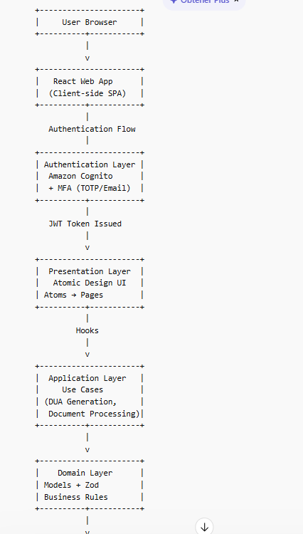
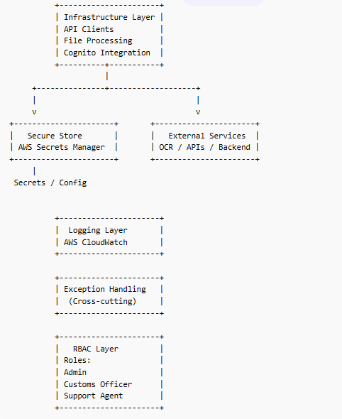
---

## 1.6 Design patterns

--Use Strategy Pattern and Factory Method Pattern to handle different document input types (Word, Excel, PDF, Images).
Concrete processors such as: WordProcessor, ExcelProcessor, PdfProcessor, ImageProcessor (OCR) are selected dynamically based on file type.

--Long-running operations such as document processing, OCR, and DUA generation are handled using Observer Pattern and Promise (Async/Future Pattern).
The UI subscribes to processing updates and receives notifications when tasks are completed.

--Use Singleton Pattern for shared instances such as:
ExceptionHandling, Logger, AuthService, ApiClients, Settings, and StateManagement.

--Use Strategy Pattern and Decorator Pattern to manage token protection mechanisms.
This allows switching between strategies such as JWT, Encrypted Storage, or HttpOnly Cookies, and adding extra security layers dynamically.

--Use Facade Pattern and Adapter Pattern to reduce the proliferation of API clients.
A unified service interface (e.g., DUAServiceFacade) abstracts multiple backend and external services, while adapters standardize different API responses.

--Use Template Method Pattern and Interpreter Pattern to perform text replacement in the final Word document in a format-agnostic way.
Placeholders such as {{importer.name}} or {{invoice.total}} are interpreted dynamically, regardless of document structure or section.

---

## 1.7 Project Scaffold (/src)

The following folder structure represents the frontend scaffold based on the defined architecture.

/src  
├── [app](./src/app)  
│   ├── [providers](./src/app/providers)  
│  
├── [presentation](./src/presentation)  
│   ├── [atoms](./src/presentation/atoms)  
│   ├── [molecules](./src/presentation/molecules)  
│   ├── [organisms](./src/presentation/organisms)  
│   ├── [templates](./src/presentation/templates)  
│   └── [pages](./src/presentation/pages)  
│  
├── [hooks](./src/hooks)  
│  
├── [application](./src/application)  
│   ├── [useCases](./src/application/useCases)  
│   └── [services](./src/application/services)  
│  
├── [domain](./src/domain)  
│   ├── [models](./src/domain/models)  
│   ├── [schemas](./src/domain/schemas)  
│   └── [rules](./src/domain/rules)  
│  
├── [infrastructure](./src/infrastructure)  
│   ├── [api](./src/infrastructure/api)  
│   ├── [processors](./src/infrastructure/processors)  
│   ├── [adapters](./src/infrastructure/adapters)  
│   └── [storage](./src/infrastructure/storage)  
│  
├── [patterns](./src/patterns)  
│   ├── [observer](./src/patterns/observer)  
│   ├── [singleton](./src/patterns/singleton)  
│   └── [strategy](./src/patterns/strategy)  
│  
├── [config](./src/config)  
├── [utils](./src/utils)  
├── [tests](./src/tests)  
│   ├── [unit](./src/tests/unit)  
│   └── [integration](./src/tests/integration)  
│  
└── [index.tsx](./src/index.tsx)

---
# BACKEND
## Technology stack
- Application protocol: REST API
- Transport protocol: HTTPS 
-API Gateway: AWS API Gateway
- Hosting service: AWS ECS Fargate
- API standard: OpenAPI
- Asynchronous processing: Internal job processing  for long-running tasks
- Load balancing: Not required (handled by AWS managed services)
- API language: TypeScript
- Backend runtime: Node.js
- Backend framework: NestJS
- Repository strategy: Monorepo (shared with frontend)
- Architecture style: Modular Monolith 

-- -
# Security 
- Transport security: HTTPS
- Authentication: AWS Cognito (JWT)
- Authorization: Role-Based Access Control (RBAC)
- Encryption at rest: AES-256 (AWS KMS managed keys)
- Secrets management: AWS Secrets Manager
- API protection:

    - Rate limiting via AWS API Gateway
    - Input validation (request schema validation)
    - Payload size limit: 10MB (exceptions for document processing endpoints)

- Network security:
    - VPC with private subnets for database and internal services
    - Security Groups for access control
    - S3 and services accessed via private endpoints 

- Data retention:

    - Operational data retention: 30 days
    - Archived data stored in S3 (long-term storage)

- Compliance considerations:
    - Logging and monitoring via AWS CloudWatch
    - Data stored in defined AWS region (data residency control)
---

# Observability

- Logged events:

    - User login and logout
    - DUA process start and completion
    - File ingestion and document detection
    - OCR processing events
    - Data extraction and mapping steps
    - Validation errors and inconsistencies
    - System errors and exceptions

- Logging platform: AWS CloudWatch (structured JSON logs with request-id)

- Metrics:

    - Request latency 
    - Error rate
    - DUA processing time
    - Queue/job processing time
    - System resource usage

- Metrics platform: AWS CloudWatch Metrics

- Distributed tracing: AWS X-Ray

- Dashboards and monitoring: AWS CloudWatch Dashboards
---

# Infrastructure (DevOps)

- CI/CD automation: GitHub Actions
- Deployment tool (dev, staging, production): AWS ECS Fargate with AWS CloudFormation
---
# Availability

- Target uptime: 99.9% uptime

- Single points of failure and recovery:

    - API Gateway: managed service with high availability (no SPOF)
    - ECS Fargate (API service): multi-AZ deployment ensures service availability
    - Database (RDS): Multi-AZ with automatic failover ensures recovery
    - Storage (S3): high availability and durability managed by AWS
    - Asynchronous processing (workers): can be scaled horizontally to avoid single point of failure

- Recovery strategy:
    All components use AWS managed services with built-in high availability; any component that does not meet uptime requirements is configured with redundancy or automatic failover mechanisms
---
# Scalability

- Scalable components:

    - API service
    - Database 
    - Storage 
    - Asynchronous processing 
---
# Backend Key Workflows
## Upload files to generate DUA
- The user sends the folder path to the backend
- The backend registers a new DUA generation process in the database
- The backend scans the folder and detects all available files
- The backend reads each file and extracts raw content
- The backend stores file metadata and extracted content
- starts the document processing pipeline
## Process documents
- identifies the type of each document (PDF, Word, Excel, Image)
- extracts text from each document
- If the document is an image, OCR is applied
- The backend consolidates all extracted text
- The backend analyzes the text using semantic processing
- extracts relevant DUA information
## Generate DUA
- The backend maps extracted data to the DUA template
- The backend validates data consistency
- The backend marks fields based on confidence level
- generates the final Word document
- The backend stores the generated document
## Retrieve result
- The user requests the result
- The backend retrieves the generated DUA document
- The backend returns the document to the user